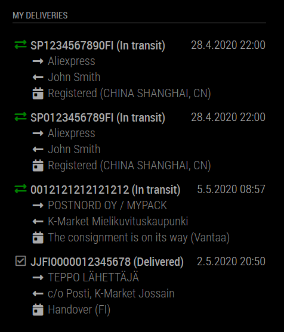

# MMM-FinParcel

`MMM-FinParcel` is a module for [MagicMirror](https://github.com/MichMich/MagicMirror) that displays the delivery status of packages from Finnish Posti and Matkahuolto. You must have an account on [Posti](https://oma.posti.fi/) and/or [Matkahuolto](https://www.matkahuolto.fi/). Configure your account credentials to module settings and packages are automatically tracked. No need to enter any tracking codes for your packages!



### Setup

Clone this module into your MagicMirror's `modules` directory and install the dependencies:

```sh
cd modules
git clone https://github.com/jesmak/MMM-FinParcel
cd MMM-FinParcel
npm install
```

then add the module to your MagicMirror's configuration. Here is an example:

```javascript
/* MagicMirror/config/config.js */
{
    /* ...your other config here */

    modules: [

        /* ...your other modules here */

        {
            module: 'MMM-FinParcel',
            header: 'My deliveries',
            position: 'top_left',
            config: {
                postiUserName: String,
                postiPassword: String,
                matkahuoltoUserName: String,
                matkahuoltoPassword: String,
                limit: Number,
                updateInterval: Number,
                showDeliveredDays: Number,
                statusTranslations: String[],
                language: 'en|fi|sv',
                loadingTranslation: String,
                noParcelsTranslation: String,
                errorTranslation: String,
                showFromTo: Boolean
            }
        }
    ]
}
```

### Configuration options

You should configure either a Posti or a Matkahuolto account (or both) for it to make any sense enabling this module.

| Configuration key | Description | Default | Required |
| --- | --- | --- | --- |
| postiUserName | Username of your Posti account. | | No |
| postiPassword | Password of your Posti account. | | No |
| matkahuoltoUserName | Username of your Matkahuolto account. | | No |
| matkahuoltoPassword | Password of your Matkahuolto account. | | No |
| limit | Limit the number of deliveries to display. If less than 1, then all deliveries are displayed. | `7` | No |
| updateInterval | Interval for updating delivery statuses. This value is in minutes. | `180` | No |
| showDeliveredDays | Number of days that delivered packages are shown. If negative, packages are shown for as long as they are available in the APIs. | `7` | No |
| statusTranslations | Translations for package statuses. | `["Delivered", "Info received", "Pending", "In transit", "Being delivered", "Ready for pickup", "Exception"]` | No |
| language | Language used when getting delivery statuses. Can be either `en`, `fi` or `sv`. | `en` | No |
| loadingTranslation | Translation for when module has just started and parcel data is still loading. | `Loading parcel data...` | No |
| noParcelsTranslation | Translation for when parcel data has been loaded but there are no results. | `No parcel data found` | No |
| errorTranslation | Translation for when there is an error loading parcel data. | `Error loading parcel data` | No |
| showFromTo | Whether to show sender and receiver for packages. | `true` | No |
